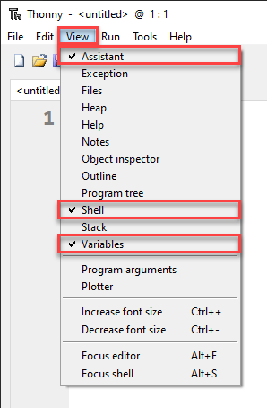

# Python Turtle - Lesson 1

> **Topics**
> In this lesson you will:
> 
> - [ ] install and setup your programming environment
> - [ ] run your first program
> - [ ] learn how to deal with error messages
> - [ ] import modules
> - [ ] create a simple turtle program

## Part 1: Thonny Introduction

<iframe width="560" height="315" src="https://www.youtube-nocookie.com/embed/90T-NE_a50E" title="YouTube video player" frameborder="0" allow="accelerometer; autoplay; clipboard-write; encrypted-media; gyroscope; picture-in-picture" allowfullscreen></iframe>

### What's an IDE

Welcome to our first lesson on Python Turtle. In this lesson you will be introduced to Thonny - the integrated development environment (IDE) we will use to write our code. We are going to have a look at a really basic python code and understand some of its syntax.

> We will be using Thonny as our IDE. Thonny is a Python IDE for beginners. It comes packaged with Python, which helps with the setup. You can download it from **[thonny.org](https://thonny.org/)**.

It's important to understand that Thonny isn't the language we will be programming with, Python. Just like you use Microsoft Word to write English, we will be using Thonny to write Python. 

Python is programmed in text files called scripts. You can use any text editor to program Python. Integrated development environment like Thonny have additional features like highlighting syntax by marking it in different colours and helping you debug your program. We will deal with those features later, in the meanwhile just think of Thonny as a text editor with extra features built in.

### Setting up Thonny

Before we look at Thonny's User Interface (UI), we need to turn on a few features so our IDE looks the same.

> Throughout this course, **bold words** are words that you need to look for on the UI

First, go to the **View** menu and make sure there is a tick beside **Assistant**, **Shell** and **Variable**.



Next go to **Tools** &rarr; **Options**


On the **Editor** tab make sure that your check-boxes are the same as the image below.


Finally on the **Theme and Font** tab make sure that the **Syntax theme** is set to **IDLE Classic**. Syntactic highlighting changes the colour of words, depending on their role in the code. This helps us to structure our code the right way.


Now click **OK** and your Thonny will look the same as the one in the videos.

### The User Interface

The image below shows the Thonny UI parts that you need to know to get started. We'll learn more as they are needed.


### First Program

For our first program we are going to make a really simple little program called *hello world*, because this is the traditional first program to write.

Type the following code into the Code panel.

``` python
# Our First Program

print("Hello World")
```

#### Predict

Remember the PRIMM process (*Predict*, *Run*, *Investigate*, *Modify*, *Make*). Before you run the code you need to *predict* what you think will happen. Go ahead and have a guess at what you think will happen. 

#### Run

Now go ahead and *run* the code by clicking on the **Play button** (or you can press F5 on your keyboard).

Your **Shell** should now show `Hello World`. Is that what you predicted would happen?

#### Investigate

Let's *investigate* what happened.

The first thing to notice is that only `Hello World` appears in the terminal. The program completely misses the first line: `# Our First Program`. Why is that? Well. Starting a line with the `#` character tells Python that the line is a comment. It is only meant to be read by humans, so the computer will ignore that line. It's a way to make notes throughout your code.

Next notice line `3`. The word `print` is in purple. This tells the coder that `print` is a keyword in Python. A key word is like a command. Try removing the `n` from print so the line now reads `prit("Hello World")`. Try running the code now and see what happens.

You should get the following error message in your **Shell**:

```
Traceback (most recent call last):
  File "<string>", line 3, in <module>
NameError: name 'prnt' is not defined
```

Let's unpack that error message. The first line `Traceback (most recent call last):` is Python saying "this is where I got up to".

The second line `File "<string>", line 3, in <module>` tells you the file and the line of the error. In our case it is `line 3`.

Finally the last line `NameError: name 'prnt' is not defined` explains the type of error. In this case it is a `NameError` which means it's found a word that it doesn't understand. It then tell us which word `prnt`.

Now go back to line `3` and fix it up so it reads `print("Hello World")` again. Notice that `print` turns back to purple.

Let's keep investigating by removing the `"` so line`3` reads `print(Hello World)`, and then run the program again.

Once again your **Shell** contains another error:

```
Traceback (most recent call last):
  File "<string>", line 3
    print(Hello World)
          ^^^^^^^^^^^
SyntaxError: invalid syntax. Perhaps you forgot a comma?
```

This time the error actually shows you the line with the error `print(Hello World)` and then the line underneath has a row of `^` symbols pointing to where the error is. It also tells us it is a `SyntaxError: invalid syntax.` which means it's not following Python rules. Finally it suggests what you might have done wrong `Perhaps you forgot a comma?`. The suggestion is wrong in this case, but luckily we know what we did wrong.

Change line `3` back so that is reads `print("Hello World")` again. Notice how `"Hello World"` turns green? This syntax highlighting lets you know that the `Hello World` is a thing called a string. For the time being just think of a string as a whole bunch of characters. We will learn more about strings later on.

Continuing with the *Investigation* of line `3`, lets remove the `(` and `)` characters. So it now reads `print Hello World`. Running this will present the following error in your *Shell*

```
Traceback (most recent call last):
  File "<string>", line 3
    print "Hello World"
    ^^^^^^^^^^^^^^^^^^^
SyntaxError: Missing parentheses in call to 'print'. Did you mean print(...)?
```

The error message should look familiar now. It's another `SyntaxError` but a different one called `Missing parentheses in call to 'print'`. Parentheses are the curved bracket we just removed. This time Python's hint was correct `Did you mean print(...)?`.

Now lets just replace the opening parenthesis `(` so line `3` now reads `print("Hello World"`. Run it and your will notice the error message change changed to a different syntax error.

```
Traceback (most recent call last):
  File "<string>", line 3
    print ("Hello World"
          ^
SyntaxError: '(' was never closed
```

It is now letting you know that you failed to close your parenthesis. In Python every opening parenthesis `(` needs to be matched with a closing parenthesis `)`. But before you fix line`3`, look at Thonny. Notice from `(` onwards is highlighted grey. This is Thonny's way of letting you know that a opening parenthesis was not closed. That way you can catch the error before running your code.

Ok you can fix line `3` up now so it reads `print("Hello World")`.

Ok our investigation is over, and you have met some of the error messages. In your time coding, you will meet many, many more of these error messages. Don't be discouraged by them. Even the most experienced programmers regularly get error messages. In fact there is a saying amongst programmers: error messages are your friend. They help you work out what when wrong.

#### Modify

Now time to *modify* the code. There's not much code there. But spend some time making the code print different things to the **Shell**.

## Part 2: Introducing turtle

<iframe width="560" height="315" src="https://www.youtube-nocookie.com/embed/CBrm4-ECyMI" title="YouTube video player" frameborder="0" allow="accelerometer; autoplay; clipboard-write; encrypted-media; gyroscope; picture-in-picture" allowfullscreen></iframe>

### First turtle program

Let get started on our first Turtle program. Click the **New** icon and the type the following into the new file and then save it using the name **lesson_1_pt_1.py**.

```python
# Our first turtle program
```

The Python programming language has a limited default set of commands (called function), but it also has access to whole libraries of other commands (called modules). One of those other modules is called *Turtle*. To tell Python to use these other modules, we use the `import` command. So we will now tell Python to `import turtle`. It is best to always put your `import` commands right at the top of your Python program.

Your code should look like this:

```python
# Our first turtle program

import turtle
```

### Create a turtle

What is a turtle? Well, a turtle is a little arrow that you can command to move around the screen. By before we can program the turtle, we have to make one. On line `5` type the line `my_ttl = turtle.Turtle()`. Let's explore that line:

- `turtle.Turtle()` tells Python from the *turtle* module you just imported (`turtle.`) use the command `Turtle()` to create a turtle.
- `myttl =` names the newly created turtle `myttl`. You can name the turtle anything you want. In fact the name `myttl` is pretty lame, so go ahead and name it whatever you want, but it can only be a *one word name*, and remember, where ever you see `myttl` you need to substitute it with your name.

Your code should now look like this.

```python
# Our first turtle program

import turtle

my_ttl = turtle.Turtle()
```

### Make your turtle move

Next we're going to make the turtle move. So, on line `7` type `my_ttl.forward(100)`. You code should now look like this.

```python
# Our first turtle program

import turtle

my_ttl = turtle.Turtle()

my_ttl.forward(100)
```

#### PRIMM

- Predict: We're about ready to run our first turtle program, but before we do you need to *predict* what you think will happen.
- Run: Now *run* the program and see if it follows your prediction. You probably predicted the movement to the right, but did you predict that it would leave a trail behind it?
- Investigate: Just like we did with `Hello World` *investigate* the code by changing things and seeing what happens.
- Modify: Finally, *modify* the code so the draws different lengths of line.

### Changing the turtle environment

Before we go any further, let's change the turtle environment so its consistence between all our computers. The first thing we will do is make the Turtle window the same size.

Change your code to make it look the same as below.

```python
# Our first turtle program

import turtle

window = turtle.Screen()
window.setup(500,500)

my_ttl = turtle.Turtle()

my_ttl.forward(100)
```

Let's talk about the changes.

In the turtle module the window is called a Screen. Line `5` of our new code makes a screen, much in the same way that we make a turtle:

- `turtle.Screen()` tells Python from the *turtle* module (`turtle.`) use the command `Screen()` to create a screen.
- `window =` give the newly created screen the name `window`.

In line `6` we use `window.setup(500,500)` to set the size of window as 500 pixels wide, by 500 pixels high.

> What's a pixel? Well, you screen is made up of thousand of little dots, if you look really close at your screen you might see them. You might read that a screen is 1920 x 1080. This is talking about pixels, it means the screen is 1,920 pixel wide and 1,080 pixels high. We'll learn more about pixels latter in the course.

For our current purposes, pixels are our measurement of movement on the screen, so `forward(100)` is actually saying move forward 100 pixels.

The second change we're going to make is purely about looks. From the code below, add line `9` to your code.

```python
# Our first turtle program

import turtle

window = turtle.Screen()
window.setup(500,500)

my_ttl = turtle.Turtle()
my_ttl.shape("turtle")

my_ttl.forward(100)
```

Do you want to predict what this change will do? Try running the code to see if you're correct.

### Change direction

So now that we have fixed our window size and dealt with out turtle's identity crisis, time to do some more drawing. At the bottom of your code, add two more lines:

- `my_ttl.left(90)`
- `my_ttl.forward(100)`

Your code should now look like this:

```python
# Our first turtle program

import turtle

window = turtle.Screen()
window.setup(500,500)

my_ttl = turtle.Turtle()
my_ttl.shape("turtle")

my_ttl.forward(100)
my_ttl.left(90)
my_ttl.forward(100)
```

- Predict: What do you think this code will do. Try to be specific in your description. Take a piece of paper and physically draw what you think will happen.
- Run: Now *run* the program and see if it follows your prediction. Did the turtle drawing look the same as your drawing?
- Investigate: When *investigating*, try changing the values in the bracket and seeing what this does.

## Exercises

In this course, the exercises are the Make component of the PRIMM model.

### Exercise 1

Create a new file and save it in your subject folder calling it **`lesson_1_ex_1.py`**. Then type the following code into it.

```python
## Draw a square with the Turtle ##

import turtle

window = turtle.Screen()
window.setup(500, 500)

myttl = turtle.Turtle()

## Write your code below this line ##
```

After line `10`, as the comments says, write code that will create a square.

### Exercise 2

Create a new file and save it in your subject folder calling it **`lesson_1_ex_2.py`**. Then type the following code into it.

```python
## Draw a Triangle with the Turtle ##

import turtle

window = turtle.Screen()
window.setup(500, 500)

myttl = turtle.Turtle()

## Write your code below this line ##
```

After line `10`, as the comments says, write code that will create a triangle.

### Exercise 3

Create a new file and save it in your subject folder calling it **`lesson_1_ex_3.py`**. Then type the following code into it.

```python
## Draw a hexagon with the Turtle ##

import turtle

window = turtle.Screen()
window.setup(500, 500)

myttl = turtle.Turtle()

## Write your code below this line ##
```

After line `10`, as the comments says, write code that will create a hexagon.