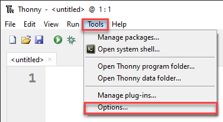

# Python Turtle - Lesson 1

---
## Topics
In this lesson we will:

- install and setup your programming environment
- run your first program
- learn how to deal with error messages
- import modules
- create a simple turtle program

---

## Part 1: Thonny Introduction

---

### What is Thonny?

Thonny is a Python integrated development environment (IDE) for beginners. 

- Comes packaged with Python
- Download it from **[thonny.org](https://thonny.org/)**.

Thonny isn't the language we will be programming with, Python is. 

- Microsoft Word &rarr; write English
- Thonny &rarr; write Python.

---

### What is Thonny?

Python is programmed in text files called scripts.

- use any text editor to write Python. 
- IDE offer additional features:
  - highlighting syntax by marking it in different colours
  - helping you debug your program 

Think of Thonny as a text editor with extra features built in.

---

### Setting up Thonny

Before we look at Thonny's User Interface (UI), we need to turn on a few features so our IDE looks the same.

> Throughout this course, **bold words** are words that you need to look for on the UI

---

First, go to the **View** menu and make sure there is a tick beside **Assistant**, **Shell** and **Variable**.


---

Next go to **Tools** &rarr; **Options**



---

On the **Editor** tab make sure that your check-boxes are the same as the image below.


---

On the **Theme and Font** tab make sure that the **Syntax theme** is set to **IDLE Classic**. 


---

### The User Interface


---

### First Program

For our first program we are going to make a really simple little program called *hello world*, because this is the traditional first program to write.

Type the following code into the Code panel:

``` python
# Our First Program

print("Hello World")
```

---

#### Predict

Remember the PRIMM process (*Predict*, *Run*, *Investigate*, *Modify*, *Make*). 

- *predict* what you think will happen when you run the code.

---

#### Run

*Run* the code by clicking on the **Play button** (or you can press F5 on your keyboard).

- **Shell** should now show `Hello World`
- Is that what you predicted would happen?

---

#### Investigate

Let's *investigate* what happened.

Only `Hello World` appears in the terminal

- misses the first line: `# Our First Program`. Why is that? Well.
- the `#` character &rarr; comment (meant to be read by humans)
- Python will ignore it
- make notes throughout your code

---

Line `3`

- `print` is in purple
- means `print` &rarr; a keyword in Python
 
Try removing the `n` from `print` so the line now reads:

``` python
prit("Hello World"). 
```

Try running the code now and see what happens.

---

Error message in  **Shell**:

```
Traceback (most recent call last):
  File "<string>", line 3, in <module>
NameError: name 'prnt' is not defined
```

Unpack the error message:

- `Traceback (most recent call last):` &rarr; "this is where I got up to".
- `File "<string>", line 3, in <module>` &rarr; the file and the line of the error.
- `NameError: name 'prnt' is not defined` &rarr; the type of error
  - `NameError` &rarr; found a word that it doesn't understand
  - `prnt` &rarr; the word it doesn't understand

---

Return line `3` to  `print("Hello World")` 

- notice `print` turns back to purple.

Remove `"` so line`3` reads:

``` python
print(Hello World)
```

Run the program again

---

Error message in **Shell**:

```
Traceback (most recent call last):
  File "<string>", line 3
    print(Hello World)
          ^^^^^^^^^^^
SyntaxError: invalid syntax. Perhaps you forgot a comma?
```

Unpack the error message:

- shows you the line with the error `print(Hello World)`
- the line underneath uses `^` symbols to point to the error
- `SyntaxError: invalid syntax.` &rarr; not following Python's rules
- `Perhaps you forgot a comma?` &rarr; what you might have done wrong
  - suggestion is wrong in this case

---

Return line `3` back to `print("Hello World")`

- notice `"Hello World"` turns green
  - syntax highlighting
  - `Hello World` &rarr; string

Remove the `(` and `)` characters so line reads:

``` python
print Hello World
```

Run the program again

---

Error message in **Shell**:

```
Traceback (most recent call last):
  File "<string>", line 3
    print "Hello World"
    ^^^^^^^^^^^^^^^^^^^
SyntaxError: Missing parentheses in call to 'print'. Did you mean print(...)?
```

Unpack the error message:

- another `SyntaxError` 
- error type &rarr; `Missing parentheses in call to 'print'`
- hint is correct &rarr; `Did you mean print(...)?`

---

Just replace the opening parenthesis `(` 

Line `3` should read

``` python
print("Hello World"
```

Run the program again

---

Error message in **Shell**:

```
Traceback (most recent call last):
  File "<string>", line 3
    print ("Hello World"
          ^
SyntaxError: '(' was never closed
```

Unpack the error message:

- different type of syntax error
- failed to close your parenthesis

Every opening parenthesis `(` needs to be matched with a closing parenthesis `)`.

- notice from `(` onwards is highlighted grey
- Thonny letting you know a opening parenthesis was not closed

---

#### Modify

Time to *modify* the code

Return line `3` back to `print("Hello World")`

Spend some time making the code print different things to the **Shell**

---

## Part 2: Introducing turtle

---

### First turtle program

- Click the **New** icon
- type the following into the new file
- save it using the name **lesson_1_pt_1.py**.

```python
# Our first turtle program
```

---

- Python has limited default commands (functions)
- access to whole libraries of other commands (modules)
  - *Turtle* one of those modules
- use the `import` command to access these other modules
- tell Python to `import turtle`
  - always put your `import` commands right at the top of your Python program

Your code should look like this:

```python
# Our first turtle program

import turtle
```

---

### Create a turtle

A turtle is a little arrow that you can command to move around the screen.

Before we can program the turtle, we have to make one

On line `5` type `my_ttl = turtle.Turtle()`

Explore that line:

- `turtle.Turtle()` 
  - from the *turtle* module (`turtle.`)
  - use the `Turtle()` command
- `myttl =` names the turtle `myttl`

---

Your code should now look like this.

```python
# Our first turtle program

import turtle

my_ttl = turtle.Turtle()
```

---

### Make your turtle move

On line `7` type `my_ttl.forward(100)`

Your code should now look like this:

```python
# Our first turtle program

import turtle

my_ttl = turtle.Turtle()

my_ttl.forward(100)
```

---

#### PRIMM

- *Predict* what you think will happen
- *Run* the program and see if it follows your prediction
- *Investigate* the code by changing things and seeing what happens
- *Modify* the code so the draws different lengths of line

---

### Changing the turtle environment

Change the turtle environment &rarr; make the Turtle window the same size across all computers

Change your code to make it look the same as below:

```python
# Our first turtle program

import turtle

window = turtle.Screen()
window.setup(500,500)

my_ttl = turtle.Turtle()

my_ttl.forward(100)
```

---

Line `5` of our new code makes a screen (window):

- `turtle.Screen()`
  - from the *turtle* module (`turtle.`)
  - use the `Screen()` command
- `window =` names the screen `window`

Line `6`:

- `window.setup(500,500)` to set the window size
  - 500 pixels wide
  - 500 pixels high

---

#### What's a pixel?

Screens are made up of thousand of little dots called pixels

A screen spec of 1920 x 1080 means:

- 1,920 pixels wide
- 1,080 pixels high

For our purposes: pixels are our measurement of movement on the screen

- `forward(100)` &rarr; move forward 100 pixels.

---

Second environment change is about looks. 

From the code below, add line `9` to your code.

```python
# Our first turtle program

import turtle

window = turtle.Screen()
window.setup(500,500)

my_ttl = turtle.Turtle()
my_ttl.shape("turtle")

my_ttl.forward(100)
```

Predict what this change will do.

---

### Change direction

At the bottom of your code, add two more lines:

- `my_ttl.left(90)`
- `my_ttl.forward(100)`

---

Your code should now look like this:

```python
# Our first turtle program

import turtle

window = turtle.Screen()
window.setup(500,500)

my_ttl = turtle.Turtle()
my_ttl.shape("turtle")

my_ttl.forward(100)
my_ttl.left(90)
my_ttl.forward(100)
```

---

#### PRIMM

- Predict:
  - try to be specific
  - physically draw what you think will happen.
- Run: 
  - Did the turtle drawing look the same as your drawing?
- Investigate: 
  - try changing the values in the parenthesis

---

## Exercises

The exercises are the *make* component of the PRIMM model

Work through the five exercise and *make* your own code