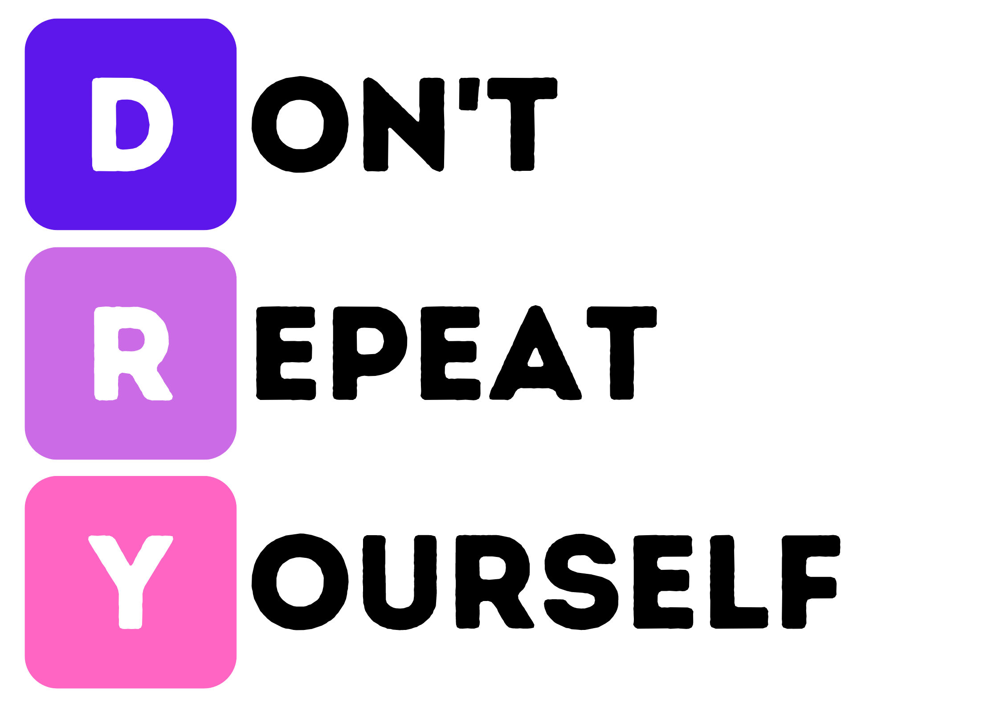
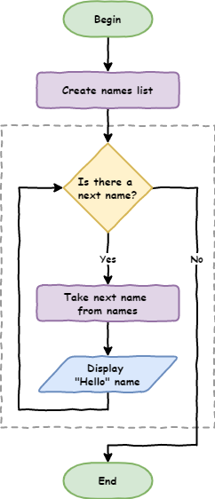
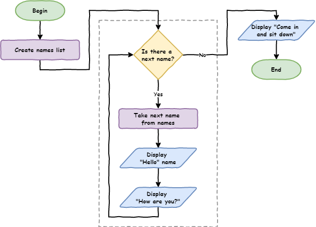

# Lesson 2

> **Topics**
> In this lesson you will:
>
> - [ ] learn how to use iteration to reduce your code length
> - [ ] learn how to represent programs in a flowchart
> - [ ] write turtle programs using a `for` loop

## Part 1: Iteration introduction

<iframe width="560" height="315" src="https://www.youtube-nocookie.com/embed/_qZzz4lSckk" title="YouTube video player" frameborder="0" allow="accelerometer; autoplay; clipboard-write; encrypted-media; gyroscope; picture-in-picture" allowfullscreen></iframe>

So far with our programming Python has been executing each line of our code one after another. This is called *sequential* and is the default way that programs work. They start at the top and move their way through the code. This movement is called *the flow* of the program (like water, or electricity).

### Introduction to flowcharts

There is a special diagram that is used to show this flow of the computer program. It's called a flowchart. Flowcharts show each process in a program and how the program move from one process to the next. We use rectangles to symbolise processes and arrows to represent the flow.


If we wanted a program to say hello to six people, you would show it in a flowchart like this:


Create a new file in Thonny and call it **lesson_2_pt_1.py**. Transferring this flowchart code to Python by entering the following code: 

```python
# our itreation program

print("Hello Hunter")
print("Hello Jordi")
print("Hello Adam")
print("Hello Jesse")
print("Hello Bryce")
print("Hello Ben")
```

Since the flow is sequential, Python will start at line `1` and work its way down to line `8`. Type it in and try it.

If you change the order of the code the program will run differently.

```python
# our itreation program

print("Hello Jesse")
print("Hello Bryce")
print("Hello Ben")
print("Hello Hunter")
print("Hello Jordi")
print("Hello Adam")
```

Sequential programming is ok, but starts to become a problem when you are dealing with bigger programs. You don't want to have to type everything out.

Imagine if I want to say hello to 500 people, or 1,000 people or more, how tedious will it be to type each line out? There is also other limitations.

What if I decided to say 'good morning' rather than 'hello'? I would have to go along and change every single line of code.

This might be ok for a small program, but starts to become a problem when dealing with larger and larger programs. In Digital Technologies we would say that his is not *scalable*.

### Iteration

If you look closely at the code you will notice that there is a lot of repetition.

```python
# our itreation program

print("Hello Jesse")
print("Hello Bryce")
print("Hello Ben")
print("Hello Hunter")
print("Hello Jordi")
print("Hello Adam")
```

Lines `3` to `8` is essentially the same line, with only the name changing each time. This clashes with the DRY programming principle.



One of the methods of not repeating yourself, is to use *iteration* (often called *loops*). They repeat the same code with a slight change each time. This would be perfect for our use, as we want to repeat the code `print("Hello", name)` with a different name each time.

### For loops

The first loop we will use is called the `for` loop. This is the first *control structure* that we've used. They're called control structures because the control the flow of the program causing it to deviate from its default sequential flow.

Change your code, so it is the same as the code below

```python
# our itreation program

names = ["Hunter", "Jordi", "Adam", "Jesse", "Bryce", "Ben"]

for name in names:
    print("Hello", name)
```

Ok, let's run the code, but don't forget PRIMM, and make sure you *predict* what you think will happen before you *run* the code.

So let's *investigate*.

Line `3` is something we haven't seen before. It's called a *list* and it works just like a real world list. There are a number of items, and they are in a specific order:

- the `[` and `]` indicate the beginning and end of the list.
- `"Hunter"`, `"Jordi"`, `"Adam"`, `"Jesse"`, `"Bryce"`, `"Ben"` are all items in the list. They're called *elements*.
- the elements are separated with comma `,`.
- we need to give this list a name (just like our turtle and window). We use `names =` to call the list `names`.

Line `5` is also new, and it is the how we create `for` loops in Python.

- `for` is a keyword identifying this as the beginning of a `for` loop
- `in names` tells Python to repeat the code below using each *element* of the `names` list
- `name` refers to the current `names` element being used.

Line `6` is a bit changed as well

- it is indented: this indentation below the `for` loop identifies the code that needs to be repeated.
  - indentations can be many lines
  - multiple line indented code is called a *block*
  - indents should be four spaces. In Thonny you can use the `tab` key because Thonny will just insert four spaces instead of a `tab` character.
- `print("Hello", name)` tells Python to print `Hello` to the **Shell** followed by the current element that the `for` statement has taken from the `names` list.

#### For loop flowchart

A bit confusing? Let's try looking at it in a flowchart.

Before we do, we need to learn about two more flowchart symbols:

- *Terminators*: these represent the the beginning and end of your code
- *Decisions*: these are questions the program need to answer, and will result in the flow splitting into multiple branches.


Now lets look at the `for` loop flowchart.



#### Tracing with debugger

One last way we can see how the `for` loop works is to use Thonny's debugger. 

You launch the debugger by clicking the bug beside the play button.


Now keep pressing **F7** on your keyboard and Thonny will take you step by step through the code. Take note of the values in the **Variables** panel.

We'll learn more about how to use the debugger later in the course.

### Code blocks

Earlier we said that multiple lines of indented code is called a block. Lets have a look at how they work.

Change your code so it is the same as below:

```python
# our itreation program

names = ["Hunter", "Jordi", "Adam", "Bryce", "Ben"]

for name in names:
    print("Hello", name)
    print("How are you?")
```

*Predict* what you think the code will do and then *run* it.

In your **Shell** you should have:

```
Hello Hunter
How are you?
Hello Jordi
How are you?
Hello Adam
How are you?
Hello Jesse
How are you?
Hello Bryce
How are you?
Hello Ben
How are you?
```

Notice all the code block is repeated. That means all the lines of code, at the same level of indentation, are repeated with the for loop. It's important to ensure that the code block uses the same number of spaces.

What happens if we remove the indentation? 

Change your code by adding `print("Come in and sit down")` to the end. Make sure you remove the indentation, so you code looks like the code below:

```python
# our itreation program

names = ["Hunter", "Jordi", "Adam", "Bryce", "Ben"]

for name in names:
    print("Hello", name)
    print("How are you?")

print("Come in and sit down")
```

*Predict* and *run* your code.

Your **Shell** should show:

```
Hello Hunter
How are you?
Hello Jordi
How are you?
Hello Adam
How are you?
Hello Jesse
How are you?
Hello Bryce
How are you?
Hello Ben
How are you?
Come in and sit down
```

Notice that `print("Come in and sit down")` is not repeated. Because it is not indented, it is not considered part of the `for` loop and is run after the `for` loop is finished.

The flowchart for your latest code would look like:




## Part 2: List numbers and Range

<iframe width="560" height="315" src="https://www.youtube-nocookie.com/embed/SpyHWIDWY5M" title="YouTube video player" frameborder="0" allow="accelerometer; autoplay; clipboard-write; encrypted-media; gyroscope; picture-in-picture" allowfullscreen></iframe>

You can also run loops over lists of numbers.

Create a new file and call it **lesson_2_pt_2a.py** then try the code below:

```python
number_list = [1, 2, 3, 4, 5, 6, 7, 8, 9, 10]

for number in number_list:
    print(number)
```

But what if we want `print` the numbers between 1 and 100? Do you really want to type all those numbers out? Luckily Python has a function called `range` which makes list between two given numbers.

Try the code below:

```python
number_list = range(1,101)

for number in number_list:
    print(number)
```

Let's unpack that code:

- `range` tells Python on create a list of numbers
- `1` is the first number in that list
- `101` is the first number *not* in that list. This can be confusing but we will learn why later on.

We can actually use the `range` function directly in the `for` loop.

```python
for number in range(1,101):
    print(number)
```

### Use for Turtle

Code blocks can be made up of any code, including Turtle code. So let try it.

Create a new file called **lesson_2_pt_2b.py** and type in the code below.

```python
import turtle

window = turtle.Screen()
window.setup(500,500)

my_ttl = turtle.Turtle()

for number in range(1,101):
    my_ttl.forward(100)
    my_ttl.backward(100)
    my_ttl.left(3)
```

PRIMM:

- *Predict* what you think will happen, and then *run* the code. Did it do what you predicted?
- *Investigate* the code by changing aspect of the code.
- *Modify* the code so that is makes a complete circle.

## Make (Exercises)

In this course, the exercises are the *make* component of the PRIMM model. So work through the following exercise and *make* your own code.

### Exercise 1

Create a new file and save it in your subject folder calling it **lesson_2_ex_1.py**. Then type the following code into it.

```python
import turtle

window = turtle.Screen()
window.setup(500, 500)
my_ttl = turtle.Turtle()

##############################
## Draw a square in 3 lines ##
##############################
```

After line `9`, as the comments says, write code that will create a square but only use 3 lines to do this (hint: try a `for` loop).


### Exercise 2

Create a new file and save it in your subject folder calling it **lesson_2_ex_2.py**. Then type the following code into it.

``` python
import turtle

window = turtle.Screen()
window.setup(500, 500)
my_ttl = turtle.Turtle()

################################
## Draw a Triangle in 3 lines ##
################################
```

After line `9`, as the comments says, write code that will create a triangle but only use 3 lines to do this.

### Exercise 3

Create a new file and save it in your subject folder calling it **lesson_2_ex_3.py**. Then type the following code into it.

```python
import turtle

window = turtle.Screen()
window.setup(500, 500)
my_ttl = turtle.Turtle()

###############################
## Draw a Hexagon in 3 lines ##
###############################
```

After line `9`, as the comments says, write code that will create a hexagon but only use 3 lines to do this.

### Exercise 4

Create a new file and save it in your subject folder calling it **lesson_2_ex_4.py**. Then type the following code into it.

```python
import turtle

window = turtle.Screen()
window.setup(500, 500)
my_ttl = turtle.Turtle()

#################################################
## Draw a circle (hint - you only need 3 lines ##
#################################################
```

### Exercise 5

Create a new file and save it in your subject folder calling it **lesson_2_ex_5.py**. Then type the following code into it.

``` python
import turtle

window = turtle.Screen()
window.setup(500, 500)
my_ttl = turtle.Turtle()

######################################################
## Go Crazy and make something amazing with loops!! ##
######################################################
```

After line `9` write some code to draw something cool using `for` loops