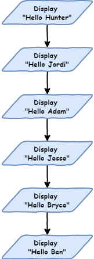

# Lesson 2

> **Topics**
> In this lesson you will:
> 
> - [ ] learn about iteration in Python
> - [ ] learn how to express program in flow charts.

## Tutorial 1: Iteration introduction

So far with our programming Python has been executing each line of our code one after another. This is called *sequential* and is the default way that programs work. They start at the top and move their way through the code. This movement is called *the flow* of the program (like water, or electricity).

### Introduction to flowcharts

There is a special diagram that is used to show this flow of the computer program. It's called a flowchart. Flow charts show each process in a program and how the program move from one process to the next. We use rectangles to symbolise processes and arrows to represent the flow.


If we wanted a program to say hello to six people, you would show it in a flow chart like this:



Transferring this code to Python would produce the following code. 

```python
# our itreation program

print("Hello Hunter")
print("Hello Jordi")
print("Hello Adam")
print("Hello Jesse")
print("Hello Bryce")
print("Hello Ben")
```

Since the flow is sequential, Python will start at line `1` and work its way down to line `8`. Type it in and try it.

If you change the order of the code the program will run differently.

```python
# our itreation program

print("Hello Jesse")
print("Hello Bryce")
print("Hello Ben")
print("Hello Hunter")
print("Hello Jordi")
print("Hello Adam")
```

Sequential programming is ok, but starts to become a problem when you are dealing with bigger programs. You don't want to have to type everything out.

Imagine if I want to say hello to 500 people, or 1,000 people or more, how tedious will it be to type each line out? There is also other limitations.

What if I decided to say 'good morning' rather than 'hello'? I would have to go along and change every single line of code.

This is ok, but start to become a problem when I want 

Doesn't scale well.

- Large number of files

- updating issues

### For Loops

Solution - the `FOR` loop

Create a list of names

```python
names = ["Hunter", "Jordi", "Adam", "Bryce", "Ben"]

for name in names:
    print("Hello", name)
```

Run through with debugger

Show how blocks work

```python
names = ["Hunter", "Jordi", "Adam", "Bryce", "Ben"]

for name in names:
    print("Hello", name)
    print("How are you?")
```

```python
names = ["Hunter", "Jordi", "Adam", "Bryce", "Ben"]

for name in names:
    print("Hello", name)
    print("How are you?")

print("Come in and sit down")
```

Student added to class

```python
names = ["Hunter", "Jordi", "Adam", "Bryce", "Ben"]

for name in names:
    print("Hello", name)

names.append("Jasper")


for name in names:
    print(name, "come in and sit down")
```

extrapolate out to huge files

Change greeting

Remove repeating code: DRY principle

## Tutorial 2: Range

You can also run loops over lists of numbers

```python
number_list = [1, 2, 3, 4, 5, 6, 7, 8, 9, 10]

for number in number_list:
    print(number)
```

Ok, now print all the numbers between 1 and 100

```python
number_list = range(1,101)

for number in number_list:
    print(number)
```

Remove step

```python
for number in range(1,101):
    print(number)
```

### Use for Turtle

```python
import turtle

window = turtle.Screen()
window.setup(500,500)

my_ttl = turtle.Turtle()

for number in range(1,101):
    my_ttl.forward(100)
    my_ttl.backward(100)
    my_ttl.left(3)
```
### Exercises
#### L2_Ex_1

```python
import turtle

window = turtle.Screen()
window.setup(500, 500)
my_ttl = turtle.Turtle()

##############################
## Draw a square in 3 lines ##
##############################
```

#### L2_Ex_2

``` python
import turtle

window = turtle.Screen()
window.setup(500, 500)
my_ttl = turtle.Turtle()

################################
## Draw a Triangle in 3 lines ##
################################
```

#### L2_Ex3

```python
import turtle

window = turtle.Screen()
window.setup(500, 500)
my_ttl = turtle.Turtle()

###############################
## Draw a Hexagon in 3 lines ##
###############################
```

#### L2_Ex4

```python
import turtle

window = turtle.Screen()
window.setup(500, 500)
my_ttl = turtle.Turtle()

#################################################
## Draw a circle (hint - you only need 3 lines ##
#################################################
```

#### L2_Ex5

``` python
import turtle

window = turtle.Screen()
window.setup(500, 500)
my_ttl = turtle.Turtle()

######################################################
## Go Crazy and make something amazing with loops!! ##
######################################################
```

