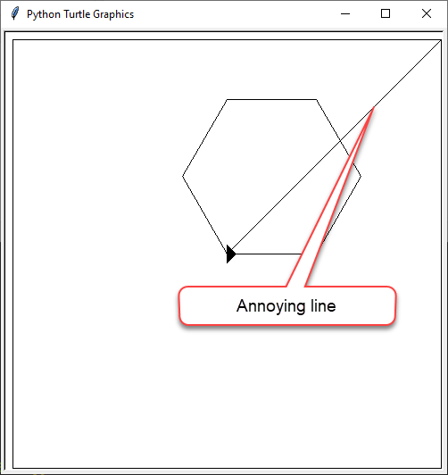

# Python Turtle - Lesson 3

---

## Topics

In this lesson you will learn:

- how to store values in variables
- when and how to use variables
- screen coordinates are
- how to use coordinates to move the turtle
- how to move the turtle without drawing a line

---

## Part 1: Variables

---

### Conventional range

Previously we used:

``` python
for index in range(1,5):
    print(number)
```

> `index` &rarr; programming for a count in a loop.

If you run this code you get:

```
1
2
3
4
```

---

Not worried about the actual numbers &rarr; needed to loop 4 times

``` python
for index in range(0,4):
    print(number)
```

This will produce:

```
0
1
2
3
```

Still has four iterations but starts counting at 0.

---

The `range` function has a starting default of `0`.

We could just use:

``` python
for index in range(4):
    print(number)
```

---

### Replace magic numbers

Create a new file named **lesson_3_pt_1.py** and enter the code below.

```python
import turtle

window = turtle.Screen()
window.setup(500, 500)
my_ttl = turtle.Turtle()

for index in range(4):
    my_ttl.forward(100)
    my_ttl.left(90)
```

Make this code draw a triangle with a side of `200`.

---

Solution

```python
import turtle

window = turtle.Screen()
window.setup(500, 500)
my_ttl = turtle.Turtle()

for index in range(3):
    my_ttl.forward(200)
    my_ttl.left(120)
```

What values did we change?

- `4` &rarr; `3` representing the number sides
- `100` &rarr; `200` representing the length of the sides
- `90` &rarr; `120` representing the degrees the Turtle has to turn

---

Need to change these specific numbers to make another shape

These are called **magic numbers**.

A **magic number** is a literal value that appears in a program.

Magic numbers are not good because:

- need work out what they represent
- don't follow the DRY principle

Remove the **magic numbers** by giving them labels called **variables**.

---

Adjust your code to:

```python
import turtle

sides = 3
length = 200
degrees = 120

window = turtle.Screen()
window.setup(500, 500)
my_ttl = turtle.Turtle()

for index in range(sides):
    my_ttl.forward(length)
    my_ttl.left(degrees)
```

---

Break the code down:

- `sides = 3` creates variable `sides` assigns it the value `3`
- `length = 200` creates variable `length` assigns it the value of `200`
- `degress = 120` creates variable `degrees` assigns it the value of `120`
- `for i in range(sides):` substitutes `sides` with the value assigned to it
  - becomes `for index in range(3)`
- `my_ttl.forward(length)` substitutes `length` with the value assigned to it
  - becomes `my_ttl.forward(200)`
- `my_ttl.left(degrees)` substitutes `degrees` with the value assigned to it
  - becomes `my_ttl.left(120)`

---

### Variable naming rules:

Python has very specific rules for what names you can use for variables:

- names can only contain letter, numbers and the `_` character
- names cannot contain spaces
- names cannot start with a number
- names are case sensitive (eg. `age` is not the same as `Age`)

Breaking these rules &rarr; syntax error

---

In programming this is called as **single point of truth**.

Single point of truth:

- copy the `for` loop and use it as many times
- `sides`, `length`, and `degrees` use the value assigned to them
- change the value assigned to `sides` &rarr; changed in all places where `sides` is used

Change **lesson_3_pt_1.py**  so it draws a hexagon with a side length of 100.

---

Your code should look like:

```python
import turtle

sides = 6
length = 100
degrees = 60

window = turtle.Screen()
window.setup(500, 500)
my_ttl = turtle.Turtle()

for index in range(sides):
    my_ttl.forward(length)
    my_ttl.left(degrees)
```

---

### Remove calculations from 'meat space'

How did we know that degrees needed to be 60?

Worked it out in your head, or use a calculator.

Approaches are flawed:

- head: calculations can be incorrect
- calculator waste of time

Do the calculations directly in Python when `degrees` is assigned

`degrees = 306 / sides`

---

Let's put that into our code at line `5`:

```python
import turtle

sides = 6
length = 100
degrees = 360 / sides

window = turtle.Screen()
window.setup(500, 500)
my_ttl = turtle.Turtle()

for index in range(sides):
    my_ttl.forward(length)
    my_ttl.left(degrees)
```

---

### Remove unnecessary variables

Good programming practice &rarr; remove unnecessary variables. 

Instead of `degrees` variable &rarr; place calculation in the `for` loop.

Our code would look like this:

```python
import turtle

sides = 6
length = 100

window = turtle.Screen()
window.setup(500, 500)
my_ttl = turtle.Turtle()

for index in range(360 / sides):
    my_ttl.forward(length)
    my_ttl.left(degrees)
```

---

Are there any more *magic numbers*?

See if you can find any more.

---

```python
import turtle

screen = 500
sides = 6
length = 100
DEGREES_IN_CIRCLE = 360

window = turtle.Screen()
window.setup(screen, screen)
my_ttl = turtle.Turtle()

for index in range(sides):
    my_ttl.forward(length)
    my_ttl.left(DEGREES_IN_CIRCLE / sides)
```

---

### Variable naming conventions

Python's naming conventions are different from the naming rules:

- break naming rule &rarr; *syntax error*. 
- break naming convention &rarr; program will still work. 

Naming conventions are used to make your code easier to read and understand.

---

Python variable naming conventions:

- Use descriptive names that explains what value has been stored in them
  - `d = 30` &rarr; bad
  - `degrees = 30` &rarr; better
  - `degrees_celsius = 30` &rarr; best
- Use snake case in multiple word names:
  - replace the spaces with the `_` character
  - only use lower case letters
- CAPTIALIZE names of constants (variables whose value will not change)
- Do not use the names of keywords (eg. `print`, `for`, etc)

---

## Part 1 Exercises

The exercises are the *make* component of the PRIMM model

Work through the three exercise and *make* your own code

---

## Part 2: Coordinates

---

### Tidy up code

Tidy the code up by implementing some good coding principles. 

We will:

- group code under their functionality (what they do)
- use comments to signpost this functionality

---

```python
import turtle

# set up screen
screen = 500
window = turtle.Screen()
window.setup(screen, screen)

# create turtle instance
my_ttl = turtle.Turtle()
my_ttl.shape("arrow")

# shape parameters
sides = 6
length = 100
DEGREES_IN_CIRCLE = 360

# draw the shape
for index in range(sides):
    my_ttl.forward(length)
    my_ttl.left(DEGREES_IN_CIRCLE / sides)
```

---

Anyone who reads the program now knows the location for the code that deals with the functionality of:

- setting up the screen
- creating the turtle instance
- defining the shape parameters
- drawing the shape

Save the file as **lesson_3_pt_2.py** (**File** &rarr; **Save as...**)

---

### How Turtle coordinates work

Turtle window &rarr; piece of graph paper 500px wide and 500px high

- `x` represents horizontal values: `x = 500`
- `y` to represent vertical values: `y = 500`

Represent coordinates as `(500, 500)`

- first value is `x` 
- second values is `y`.

---

`(500,500)` &rarr; **tuple**. 

Tuples:

- like a list
- cannot change the values in a tuple

Can't change a value of something &rarr; **immutable**

Tuples:

- start with `(`
- end with `)`
- `,` separate the elements

---

Our Turtle window of `(500,500)` looks like this:


---

Important to note:

- origin `(0,0)` &rarr; centre of the screen
- moving up &rarr; `y` value increases (max `250`)
- moving down &rarr; `y` value decreases (min `-250`)
- moving left &rarr; `x` value increase (max `250`)
- moving right &rarr; `x` value decreases (min `-250`)
- every pixel has a `x` and `y` combination (eg. `(200,125)`)

---

### Using `goto()` to draw

Make the following adjustments in **lesson_3_pt_2.py**:

- add `my_ttl.goto(0,125)` to line `16`
- put a `#` in front of lines `19` to `21`

---

```python
import turtle

# set up screen
screen = 500
window = turtle.Screen()
window.setup(screen, screen)

# create turtle instance
my_ttl = turtle.Turtle()
my_ttl.shape("arrow")

# shape parameters
sides = 6
length = 100

my_ttl.goto(0,125)

# draw shape
#for i in range(sides):
#    my_ttl.forward(length)
#    my_ttl.left(360 / sides)
```

---

PRIMM

- *Predict* and *run* &rarr; did it do what you predicted?

- *Investigate* the by unpacking the changes:

  - `my_ttl.goto(0,125)` &rarr; turtle move to position `x = 0` and `y = 125`

  - `#` at the beginning of lines `19` to `21` &rarr; turns the code into comments

- *Modify* &rarr; turtle moves to all the points in previous diagram

---

```python
import turtle

# set up screen
screen = 500
window = turtle.Screen()
window.setup(screen, screen)

# create turtle instance
my_ttl = turtle.Turtle()
my_ttl.shape("arrow")

# draw boarder
my_ttl.goto(240,240)
my_ttl.goto(-240,240)
my_ttl.goto(-240,-240)
my_ttl.goto(240,-240)
my_ttl.goto(240,240)
my_ttl.goto(0,0)

# shape parameters
sides = 6
length = 100

my_ttl.goto(0,0)

# draw shape
for i in range(sides):
    my_ttl.forward(length)
    my_ttl.left(360 / sides)
```

---

PRIMM:

- *Predict* and then *run* the code. Did it do what you predicted?
- *Investigate* the code by changing aspect of the code

---

### Using penup() and pendown()

Get rid of the annoying line.



---

When we write:

- do not leave trailing lines &rarr; lifting our pen up and moving
- continue to write &rarr; put our pen back down

Turtle commands:

- `penup()`
- `pendown()`

---
```python
import turtle

# set up screen
screen = 500
window = turtle.Screen()
window.setup(screen, screen)

# create turtle instance
my_ttl = turtle.Turtle()
my_ttl.shape("arrow")

# draw boarder
my_ttl.penup()
my_ttl.goto(240,240)
my_ttl.pendown()
my_ttl.goto(-240,240)
my_ttl.goto(-240,-240)
my_ttl.goto(240,-240)
my_ttl.pen(up)
my_ttl.goto(0,0)
my_ttle.pendown()

# shape parameters
sides = 6
length = 100

my_ttl.goto(0,0)

# draw shape
for i in range(sides):
    my_ttl.forward(length)
    my_ttl.left(360 / sides)
```

---

## Part 2 Exercise

## Exercises

The exercises are the *make* component of the PRIMM model

Work through the last lesson 3 exercise and *make* your own code