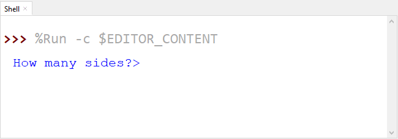

# Python Turtle - Lesson 4

> **Topics:**
> In this lesson you will learn:
>
> - [ ] What is coding modularisation
> - [ ] When to use *functions* in Python
> - [ ] How to define and use functions in Python
> - [ ] How to get user's input into your code
> - [ ] What are data types
> - [ ] How to convert between data types

## Part 1: Functions

<iframe width="560" height="315" src="https://www.youtube.com/embed/ZQNU29m5pHY" title="YouTube video player" frameborder="0" allow="accelerometer; autoplay; clipboard-write; encrypted-media; gyroscope; picture-in-picture" allowfullscreen></iframe>

### What are functions?

Functions are blocks of code that we can run several times in our program. So far in our programming all our blocks of code are only run once. Even loop blocks are only run once, although the code inside the block is repeated. But once you have gone past a loop, you can't go back and run it gain.

With functions, we move a block of code outside of the main program sequence, and give it a label. We can then use that block as many times as we like by *calling* the function name from within the main program sequence.

To understand this more clearly, we will start with my solution for **lesson_3_ex_4.py**.

Type the code below into a new file and save in as **lesson_4_pt_1.py**.

```python
import turtle

# set up screen
screen = 500
window = turtle.Screen()
window.setup(screen, screen)

# create turtle instance
my_ttl = turtle.Turtle()
my_ttl.shape("arrow")

##################################
## Using the tutrle command you ##
## have learnt, draw a house.   ##
##################################

# move pen
my_ttl.penup()
my_ttl.goto(-100,0)
my_ttl.pendown()

# draw square
for index in range(4):
    my_ttl.forward(200)
    my_ttl.right(90)

# draw triangle
for index in range(3):
    my_ttl.forward(200)
    my_ttl.left(120)
    
# move pen
my_ttl.penup()
my_ttl.goto(-25,-200)
my_ttl.pendown()

# draw rectangle
for index in range(2):
    my_ttl.forward(50)
    my_ttl.left(90)
    my_ttl.forward(100)
    my_ttl.left(90)
    
# move pen
my_ttl.penup()
my_ttl.goto(-80,-100)
my_ttl.pendown()

# draw square
for index in range(4):
    my_ttl.forward(35)
    my_ttl.right(90)
    
# move pen
my_ttl.penup()
my_ttl.goto(45,-100)
my_ttl.pendown()

# draw square
for index in range(4):
    my_ttl.forward(35)
    my_ttl.right(90)
    
# move pen
my_ttl.penup()
my_ttl.goto(15,-150)
my_ttl.pendown()

# draw circle
my_ttl.circle(5)
my_ttl.hideturtle()
```

PRIMM:

- *Predict* the type of house that the code will draw
- *Run* the code and see if it resembles your prediction. 

Remember the DRY principle - **Don't Repeat Yourself**? Have a look at the code, how does it go in relation to DRY?

Can you identify any repetition?

Let's look at the comments?

- move pen
- draw square
- draw triangle
- move pen
- draw rectangle
- move pen
- draw square
- move pen
- draw square
- move pen
- draw circle

In summary we have two main types of repetition:

- moving the pen
- drawing the shape

When a wrote this code, I didn't type it straight out, I copied and pasted a lot of the code and just changed the magic values. Copying and pasting is a clear indicator that you need to use a function. Why? Because functions are one of the main tools we can use to enforce the DRY Principle. 

### Creating functions

Let's look at how this works.

1. take all the *move pen code* and consolidate that in one spot
   - below I have copied the first move pen action (lines `17` to `20` in the previous code)
   - I have pasted them up to the top (lines `3` to `6`) 
   - I then have turned them into a function
2. Replace the original code with a call to the function (line `22`).

Adjust your code so that it looks the same as below:

```python
import turtle

def move_pen():
    my_ttl.penup()
    my_ttl.goto(-100,0)
    my_ttl.pendown()

# set up screen
screen = 500
window = turtle.Screen()
window.setup(screen, screen)

# create turtle instance
my_ttl = turtle.Turtle()
my_ttl.shape("arrow")

##################################
## Using the tutrle command you ##
## have learnt, draw a house.   ##
##################################

move_pen()

# draw square
for index in range(4):
    my_ttl.forward(200)
    my_ttl.right(90)

# draw triangle
for index in range(3):
    my_ttl.forward(200)
    my_ttl.left(120)
    
# move pen
my_ttl.penup()
my_ttl.goto(-25,-200)
my_ttl.pendown()

# draw rectangle
for index in range(2):
    my_ttl.forward(50)
    my_ttl.left(90)
    my_ttl.forward(100)
    my_ttl.left(90)
    
# move pen
my_ttl.penup()
my_ttl.goto(-80,-100)
my_ttl.pendown()

# draw square
for index in range(4):
    my_ttl.forward(35)
    my_ttl.right(90)
    
# move pen
my_ttl.penup()
my_ttl.goto(45,-100)
my_ttl.pendown()

# draw square
for index in range(4):
    my_ttl.forward(35)
    my_ttl.right(90)
    
# move pen
my_ttl.penup()
my_ttl.goto(15,-150)
my_ttl.pendown()

# draw circle
my_ttl.circle(5)
my_ttl.hideturtle()
```

PRIMM:

- *Predict* what you think will happen
- *Run* the code and check you prediction

Now lets *investigate* the code by unpacking it:

- line `3`: `def move_pen():` create the function:
  - in programming we call this *defining* a function
  - the program reads and bookmarks the code, but does not execute it
  - `def` is the key word for defining a function
  - `move_pen()` is the name we are giving the function
    - This name is how the function is called and follows the same rules as variable names
    - By using a descriptive name, we also remove the need for comments, as the code explains itself
  - `:` tells Python that indented code follows, that same as a `for` loop
- lines `4` to `6` are indented:
  - this is the code that is executed when the function is called
  - the indentation rules are the same as the `for` loop
    - indentations can be many lines
    - multiple line indented code is called a *block*
    - indents should be four spaces
- line `22`: `move_pen()` calls the function:
  - at this point the program will go to line `3` run the code in the function
  - when the code in the function finished the program will return to line `22` and continue with the rest of the code

### Passing arguments

This works for our first pen movement, but since the coordinate values are magic numbers, I would have to create a function for each movement of the pen. This defeats the purpose of functions. What we need is a way to send the coordinates to the function when we call it. Well, we can, and they are called arguments.

Looking back at our `move_pen()` function in the code, what we need to do is get rid of the magic numbers.

``` python
def move_pen():
    my_ttl.penup()
    my_ttl.goto(-100,0)
    my_ttl.pendown()
```

What do the two magic numbers in `my_ttl.goto(-100,0)` represent? The `x` and the `y` of the coordinates. So let's replace them with variables.

``` python
def move_pen():
    my_ttl.penup()
    my_ttl.goto(x, y)
    my_ttl.pendown()
```

But how do we assign values to `x` and `y`? This is where arguments are used.

Change the function definition to `def move_pen(x, y):` so it will accept two values. Then change the function call to `move_pen(-100,0)` passing two values to the function

Let's unpack that:

- `def move_pen(x, y):` says:
  - when you call the `move_pen()` function, you need to provide two values
  - first value will be assigned to the variable `x`
  - second value will be assigned to the variable `y`
- `move_pen(-100,0)` says:
  - call the `move_pen()` function
  - use `-100` as the first value (the `x` value)
  - use `0` as the second value (the `y` value)

Your code should now look like the code below:

```python
import turtle

def move_pen(x, y):
    my_ttl.penup()
    my_ttl.goto(x,y)
    my_ttl.pendown()

# set up screen
screen = 500
window = turtle.Screen()
window.setup(screen, screen)

# create turtle instance
my_ttl = turtle.Turtle()
my_ttl.shape("arrow")

##################################
## Using the tutrle command you ##
## have learnt, draw a house.   ##
##################################

move_pen(-100,0)

# draw square
for index in range(4):
    my_ttl.forward(200)
    my_ttl.right(90)

# draw triangle
for index in range(3):
    my_ttl.forward(200)
    my_ttl.left(120)
    
# move pen
my_ttl.penup()
my_ttl.goto(-25,-200)
my_ttl.pendown()

# draw rectangle
for index in range(2):
    my_ttl.forward(50)
    my_ttl.left(90)
    my_ttl.forward(100)
    my_ttl.left(90)
    
# move pen
my_ttl.penup()
my_ttl.goto(-80,-100)
my_ttl.pendown()

# draw square
for index in range(4):
    my_ttl.forward(35)
    my_ttl.right(90)
    
# move pen
my_ttl.penup()
my_ttl.goto(45,-100)
my_ttl.pendown()

# draw square
for index in range(4):
    my_ttl.forward(35)
    my_ttl.right(90)
    
# move pen
my_ttl.penup()
my_ttl.goto(15,-150)
my_ttl.pendown()

# draw circle
my_ttl.circle(5)
my_ttl.hideturtle()
```

Run the code to check that it still draws my house. Now use the debugger and step your way through the program to see how Python calls functions.

Now go through the code and replace the remaining `# move pen` blocks with a `move_pen()` call.

Your code should now look like this:

```python
import turtle

def move_pen(x, y):
    my_ttl.penup()
    my_ttl.goto(x,y)
    my_ttl.pendown()

# set up screen
screen = 500
window = turtle.Screen()
window.setup(screen, screen)

# create turtle instance
my_ttl = turtle.Turtle()
my_ttl.shape("arrow")

##################################
## Using the tutrle command you ##
## have learnt, draw a house.   ##
##################################

move_pen(-100,0)

# draw square
for index in range(4):
    my_ttl.forward(200)
    my_ttl.right(90)

# draw triangle
for index in range(3):
    my_ttl.forward(200)
    my_ttl.left(120)
    
move_pen(-25,-200)

# draw rectangle
for index in range(2):
    my_ttl.forward(50)
    my_ttl.left(90)
    my_ttl.forward(100)
    my_ttl.left(90)
    
move_pen(-80,-100)

# draw square
for index in range(4):
    my_ttl.forward(35)
    my_ttl.right(90)

move_pen(45,-100)

# draw square
for index in range(4):
    my_ttl.forward(35)
    my_ttl.right(90)
    
move_pen(15,-150)

# draw circle
my_ttl.circle(5)
my_ttl.hideturtle()
```

Run the code to make sure the house is still being drawn.

Notice that our line count is down from the original `71` to `61`.

> **Testing**
>
> Testing hints:
>
> - it is good to frequently test your code
> - each time you change your code, test it
> - try not to make too many changes between testing, it makes it harder to identify your errors
> - if a function is tested and works, you don't have to testing it again, unless your change it.
> - if your program has errors, and your functions have passed their tests, then you know your error is elsewhere in the code.

### Shape functions

When we first looked for repetition, we also identified the drawing shapes repetition. So lets make a function to draw squares.

From the current:

- copy one of the `# draw square` blocks to the top of the code
- change it into a function that draws a square called `draw_square()`
- the function will need to accept a value for the `length` of the square's side
- then replace all the `# draw square` blocks with an appropriate `draw_square()` call

> **Function location**
>
> Normally we put all out function definitions at the top of our code, just under the import statements.
>
> This is done for two reasons:
>
> - if the function is not defined before you call it, your code will generate a `NameError`
> - placing all your functions at the start makes it easier to find them and read your code.

Once you have made `draw_square()` function changes, you code should look like:

```python
import turtle

def move_pen(x,y):
    my_ttl.penup()
    my_ttl.goto(x,y)
    my_ttl.pendown()
    
def draw_square(length):
    for index in range(4):
        my_ttl.forward(length)
        my_ttl.right(90)

# set up screen
screen = 500
window = turtle.Screen()
window.setup(screen, screen)

# create turtle instance
my_ttl = turtle.Turtle()
my_ttl.shape("arrow")

##################################
## Using the tutrle command you ##
## have learnt, draw a house.   ##
##################################

move_pen(-100,0)
draw_square(200)

# draw triangle
for index in range(3):
    my_ttl.forward(200)
    my_ttl.left(120)
    
move_pen(-25,-200)

# draw rectangle
for index in range(2):
    my_ttl.forward(50)
    my_ttl.left(90)
    my_ttl.forward(100)
    my_ttl.left(90)
    
move_pen(-80,-100)
draw_square(35)
move_pen(45,-100)
draw_square(35)
move_pen(15,-150)

# draw circle
my_ttl.circle(5)
my_ttl.hideturtle()
```

We are now down to 52 lines of code.

There is no more repetition in the main code, but there is still three code blocks remaining, but notice how the rest of the code is easier to read. So we are going to transform the `# draw triangle`, `# draw rectangle` and `# draw circle` code blocks into functions.

This will provide two benefits:

- it will make the code more readable
- if we want to extend the drawing we can easily add more rectangles, triangle and circles.

See if you can change all three blocks into functions. Remember to test each function when you create it.

When you finish your code should look like this:

```python
import turtle

def move_pen(x,y):
    my_ttl.penup()
    my_ttl.goto(x,y)
    my_ttl.pendown()
    
def draw_square(length):
    for index in range(4):
        my_ttl.forward(length)
        my_ttl.right(90)
        
def draw_triangle(length):
    for index in range(3):
        my_ttl.forward(length)
        my_ttl.left(120)

def draw_rectangle(long, short):
    for index in range(2):
        my_ttl.forward(short)
        my_ttl.left(90)
        my_ttl.forward(long)
        my_ttl.left(90)
        
def draw_circle(rad):
    my_ttl.circle(rad)

# set up screen
screen = 500
window = turtle.Screen()
window.setup(screen, screen)

# create turtle instance
my_ttl = turtle.Turtle()
my_ttl.shape("arrow")

##################################
## Using the tutrle command you ##
## have learnt, draw a house.   ##
##################################

move_pen(-100,0)
draw_square(200)
draw_triangle(200)
move_pen(-25,-200)
draw_rectangle(100,50)
move_pen(-80,-100)
draw_square(35)
move_pen(45,-100)
draw_square(35)
move_pen(15,-150)
draw_circle(5)
my_ttl.hideturtle()
```

That's our final code:

- down from `71` lines to `53` lines
- easier to read
- easier to test and troubleshoot errors

## Part 1 Exercises

In this course, the exercises are the *make* component of the PRIMM model. So work through the following exercises and *make* your own code.

### Exercise 1

Create a new file and save it in your subject folder calling it **lesson_4_ex_1.py**. Then type the following code into it.

```python
import turtle

# set up screen
screen = 500
window = turtle.Screen()
window.setup(screen, screen)

# create turtle instance
my_ttl = turtle.Turtle()
my_ttl.shape("turtle")

############################################
## Convert the code below using functions ##
############################################

# move pen
my_ttl.penup()
my_ttl.goto(0,-200)
my_ttl.pendown()

# draw head
my_ttl.color("black","yellow")
my_ttl.begin_fill()
my_ttl.circle(200)
my_ttl.end_fill()

# move pen
my_ttl.penup()
my_ttl.goto(-75,0)
my_ttl.pendown()

# draw eye
my_ttl.color("black","black")
my_ttl.begin_fill()
my_ttl.circle(50)
my_ttl.end_fill()

# move pen
my_ttl.penup()
my_ttl.goto(75,0)
my_ttl.pendown()

# draw eye
my_ttl.color("black","black")
my_ttl.begin_fill()
my_ttl.circle(50)
my_ttl.end_fill()

# move pen
my_ttl.penup()
my_ttl.goto(-100,-75)
my_ttl.pendown()

# draw mouth
my_ttl.color("black","black")
my_ttl.begin_fill()
for index in range(2):
    my_ttl.forward(200)
    my_ttl.right(90)
    my_ttl.forward(25)
    my_ttl.right(90)
my_ttl.end_fill()

my_ttl.hideturtle()
```

Follow the instructions in the comments and adapt the code so it uses functions.

### Exercise 2

Create a new file and save it in your subject folder calling it **lesson_4_ex_2.py**. Then type the following code into it.

```python
import turtle

# set up screen
screen = 500
window = turtle.Screen()
window.setup(screen, screen)

# create turtle instance
my_ttl = turtle.Turtle()
my_ttl.shape("turtle")

############################################
## Use you knowledge of Python and Turtle ##
## to draw a car. Use functions to ensure ##
## that you Do not Repeat Yourself.       ##
############################################
```

Follow the instructions in the comments and write a program that draws a car.

## Part 2: User Input

<iframe width="560" height="315" src="https://www.youtube.com/embed/HUEgYhYAuB0" title="YouTube video player" frameborder="0" allow="accelerometer; autoplay; clipboard-write; encrypted-media; gyroscope; picture-in-picture" allowfullscreen></iframe>

How can we make the computer respond to the user?

Copy the code below, save it as **lesson_4_pt_2.py** then run it.

``` python
import turtle

def draw_poly(length, sides):
    for index in range(sides):
        myttl.forward(length)
        myttl.right(360/sides)

# setup window
screen = 500
window = turtle.Screen()
window.setup(screen,screen)

# create instance of turtle
myttl = turtle.Turtle()
myttl.shape("turtle")

sides = 9
length = 100

draw_poly(length,sides)
```

PRIMM

- *Predict* what you think will happen.
- *Run* the code and see how close your prediction is.
- *Modify* the code so the shape fits within the window.

When we run the code the shape is partially off the screen. That's not a big problem, you just need to change the length from `100` to `80`. This something quite simple for you, because you have learnt how to code, but what about people who haven't?

So, how do we make our programs interactive by getting the user's input?

The simplest way to do this is to use the `input()` command which will ask the user for input in the **Shell**.

To do this change:

- line `17` to `sides = input("How many sides?> ")`
- line `18` to `length = input("How long are the sides?> ")`

Then run the code.

``` python
import turtle

def draw_poly(length, sides):
    for index in range(sides):
        myttl.forward(length)
        myttl.right(360/sides)

# setup window
screen = 500
window = turtle.Screen()
window.setup(screen,screen)

# create instance of turtle
myttl = turtle.Turtle()
myttl.shape("turtle")

sides = input("How many sides?> ")
length = input("How long are the sides?> ")

draw_poly(length,sides)
```

PRIMM

- *Predict* what you think will happen
- *Run* run the code. Did it do what you thought?
  - Did you predict:
    - a *prompt* appearing in the **Shell** like the image below?
    - the program raising the error.




```
Traceback (most recent call last):
  File "<string>", line 20, in <module>
  File "<string>", line 4, in draw_poly
TypeError: 'str' object cannot be interpreted as an integer
```

- Let's *investigate* by:
  - unpacking the code we changed
  - explaining the error

Unpacking line `17` (note line `18` is virtually the same):

- `input`: is the keyword that tells Python to wait for an input from the user from the **Shell**.
- `("How many sides?> ")` tells Python what *prompt* to write to the **Shell** before it waits for a response.
- `sides =` takes whatever the user enters and assigns it to the variable `sides`

Now for the error. This is a `TypeError` and to understand it we need to learn about *data types*.

### Data types

Variables in Python can hold different types of data. The four types of data we will be concerned with are:

- integer numbers (`int`)
  - stores whole numbers
  - can be identified by a whole whole number
- floating point numbers (`float`)
  - stores numbers that have a decimal points
  - can be identified by having a decimal point with at least one number after it. For example, `1` is and integer, `1.0` is a float
- strings (`str`)
  - stores characters like letters, numbers and special characters
  - start and end with `"` or `'` (just make sure they are the same the at beginning or end)
  - numbers can be a string. For example, a phone number like `0432 789 367` is a string not and integer or float. It contains spaces and you would never do a calculation with it.
- Booleans (`bool`)
  - stores either `True` or `False`

Using data types helps Python work out what kind of operations it can do with the variable. For example. it wouldn't make much sense to divide a string. Python also has special operations called *methods*. Each data type has it's own methods. You will learn more about data types right through your programming journey.

Now, lets look at the error again:

```
Traceback (most recent call last):
  File "<string>", line 20, in <module>
  File "<string>", line 4, in draw_poly
TypeError: 'str' object cannot be interpreted as an integer
```

`TypeError: 'str' object cannot be interpreted as an integer` tells us that this involves two data types (string and integer). It says we are trying to use a string when Python is expecting an integer.

When looking at the `Traceback` always check the last line first and in this case the error occurred at line `4`: `for index in range(sides):`. Here we are trying to use the values in `sides` to create a `range()` and Python thinks it is a string. let's look at where we got the value for `sides`

In line `17`: `sides = input("How many sides?> ")` we took whatever value the user entered and assigned it to `sides`. Now I entered `3` which is an integer, so why does Python think it's a string.

Well, when Python accepts a value using the `input()` command, it is always accepted as a string. This is because strings can contain all characters.

So how do we fix this? Luckily we can convert a variable's data type.

### Converting data types

There is a command to convert a variable in to each data type other than Boolean.

If we had a variable called `var`:

- to convert `var` into a string, use `str(var)`
- to convert `var` into an integer, use `int(var)`
- to convert `var` into a float, use `float(var)`

There is a heap more to this, but we will deal with it later. At the moment this is all you need to know.

So let's change our code so that string that is received by the `input()` statement is converted into an integer.

Make the changes below to lines `17` and `18`.

```python
import turtle

def draw_poly(length, sides):
    for index in range(sides):
        myttl.forward(length)
        myttl.right(360/sides)

# setup window
screen = 500
window = turtle.Screen()
window.setup(screen,screen)

# create instance of turtle
myttl = turtle.Turtle()
myttl.shape("turtle")

sides = int(input("How many sides?> "))
length = int(input("How long are the sides?> "))

draw_poly(length,sides)
```

PRIMM

- *Predict* what you think will happen
- *Run* you code and see if your predictions were correct
- *Investigate* by trying to enter different values for sides and length:
  - draw different shapes
  - what are the correct values to make your turtle draw a circle?
  - what happens when you enter a float or a string?
- *Modify* your code to use different prompts

## Part 2 Exercise

In this course, the exercises are the *make* component of the PRIMM model. So work through the following exercises and *make* your own code.

### Exercise 4

Create a new file and save it in your subject folder calling it **lesson_4_ex_4.py**. Then type the following code into it.

``` python
###############################################
## write a program that askes the user for a ##
## number and then counts up to that number. ##
###############################################

```

Follow the instructions in the comments and use your Python knowledge to create a count up app. Remember to apply the DRY principle